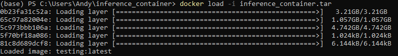
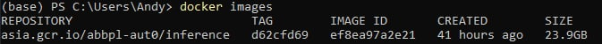
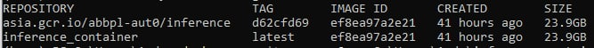
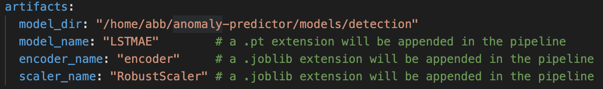
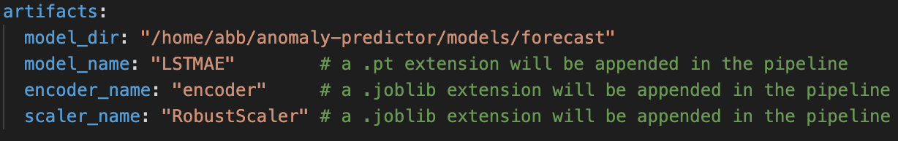
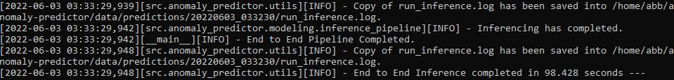
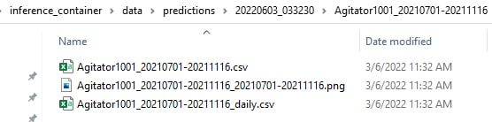
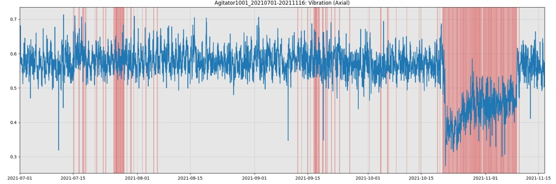

# Inference Package
## ABB: Anomaly Detection/Forecast for Industrial Motor Sensors

Main objectives of this inference package:

1. Clean and pre-process new data
2. Detect or Forecast potential anomalies using pre-processed data

---
## Table of Contents

- [Introduction](#introduction)
    - [Purpose of Package](#purpose-of-package)
- [System Requirements](#system-requirements)
    - [Recommended CLI Tool](#recommended-cli-tool)
    - [Hardware](#hardware)
    - [Software](#software)
- [Set Up](#set-Up)
    - [Setting up of Docker Desktop](#setting-up-of-docker-desktop)
    - [Loading of Docker Images](#loading-of-docker-images)
- [Usage](#usage)
    - [Edit Config Files](#edit-config-files)
    - [Running Inference](#running-inference)
    - [Viewing of Results](#viewing-of-results)
- [Customization](#customization)
    - [Changing of Mounted Directories](#changing-of-mounted-directories)
- [Uninstallation](#uninstallation)
    - [Removal of Docker Containers and Images](#removal-of-docker-containers-and-images)
- [FAQ and Troubleshooting](#faq-and-troubleshooting)

---
## Introduction

### Purpose of Package

This inference packages serves as a container for ABB to carry out detection or forecasting of potential anomalies in ABB's smart sensor data.

### Contents of Package

1. README.md
2. conf/
3. data/
4. models/
5. assets/          ***folder contains README.md's example pictures***
6. inference_container.tar
---
## System Requirements

As previously discussed, the specifications for the deployment PC should be as follows:

### Recommended CLI tools

These are the CLI tools that you can use:

1. Command Prompt ***recommended***
2. Powershell
3. Anaconda Prompt

### Hardware

|            |   Minimum  | Recommended |
| -----------| ----------- | -----------  |
| CPU | Intel Xeon E5 / Silver | |
| GPU | NVIDIA Quadro P2000 5GB | NVIDIA GPU with at least 8GB |
| RAM | 16 GB | |
| Storage | 256 | as required | 

### Software

|            |   Minimum  | Recommended |
| -----------| ----------- | -----------  |
| OS | Windows 10 1903 | Windows 10 21H2 or Windows 11 |
| Software | WSL2, Cuda drivers on WSL and Docker Desktop |

*Windows 10 21H2 or Windows 11 is recommended as it allows GPU passthrough for Docker. This allows for GPU-accerlerated inference.*

---
## Set Up

### Setting up of Docker Desktop

Please refer to this [guide](https://docs.docker.com/desktop/windows/install/) in the official docker documentation website.

After the successful installation of Docker Desktop, check if Virtualization is supported by the CPU. You may refer to this [guide](https://stackoverflow.com/questions/49005791/how-to-check-if-intel-virtualization-is-enabled-without-going-to-bios-in-windows#:~:text=If%20you%20have%20Windows%2010,is%20currently%20enabled%20in%20BIOS.).

### Loading of Docker Images

Follow the following steps to load the docker image into Docker Desktop.

1. Change working directory to folder where it contains the .tar image

2. Run the following code to load the .tar image. `docker load -i inference_container.tar` .
The layers for the image will start to load and you should see a message similar to `Loaded image: <image name>:latest` after loading all layers.




3. Run ``` docker images ``` to verify that there's a newly created image.   



4. Run ``` docker tag asia.gcr.io/abbpl-aut0/inference:<docker tag> inference_container:latest ``` to change the image's name to `inference_container` with `latest` tag. The docker tag can be extracted from `docker images`.

For Example,
``` docker tag asia.gcr.io/abbpl-aut0/inference:d62cfd69 inference_container:latest ``` 

5. Run ``` docker images ``` again to verify that image inference_container is created.



---
## Usage

### Mounted Volumes
There will be 3 mounted volumes for the inference container:

1. `conf` will contains the various config files required for the container.
2. `data` will contains the respective data (Input, processed, predictions).
3. `models` will contains the required artifacts for inference (LSTMAE/Scalers/Encoder).

#### Folder Structure of `conf`
```
conf
 └── docker
    └── inference_pipeline.yml 
```

#### Folder Structure of `data`
```
data
 ├── input
 │    └── my_inference_run # user-defined dir name
 │        └── assets
 │            └── Crusher3
 │                ├── Crusher3_startdate_enddate1.xlsx
 │                └── Crusher3_startdate_enddate2.xlsx
 ├── interim
 │    └── 20220323_hhmmss # inference timestamp
 │        └── Crusher3_startdate_enddate.csv
 ├── processed
 │    └── 20220323_hhmmss
 │        └── Crusher3_startdate_enddate.csv
 └── predictions
      └── 20220323_hhmmss
          └── Crusher3_startdate_enddate
              ├── Crusher3_startdate_enddate.png
              └── Crusher3_startdate_enddate.csv
```
*Interim, Processed and Predictions folders will be created by pipeline if it doesnt exist*
#### Folder Structure of models
```
models
 └── 20220323_hhmmss # models training timestamp
     ├── LSTMAE.pt # Model Name
     ├── encoder.joblib #encoder for OHE
     ├── model_params.json #Json format of model training parameters
     ├── train_pipeline.yml #copy of yaml file for training - to extract training parameters
     ├── RobustScaler.joblib #General Scaler
     └── scalers #folder of respective scalers
         ├── Agitator1001.joblib
         ├── Agitator1002.joblib
         ├── ...
         └── Roller1002.joblib
```

### Edit Config Files

***inference_pipeline.yml contains every configurable parameter to be used during inference.***

`inference_pipeline.yml` can be used to change the data path or models path for inference.



Please bear in mind that filepaths should be absolute, with reference to the container's directory structure.
`/home/abb/anomaly-predictor` is the working directory of the Docker container.

For example, to change the model to forecast for inference,
edit the file path  for model_dir to `model_dir:"/home/abb/anomaly-predictor/models/forecast"`



### Running Inference

#### Using CPU for inference
Run the following line in CLI to perform any inference using the newly built Docker image, 
``` 
docker run -it -v <local path to data folder>:/home/abb/anomaly-predictor/data ^
-v <local path to conf folder>:/home/abb/anomaly-predictor/conf ^
-v <local path to models folder>:/home/abb/anomaly-predictor/models inference_container
```
For example,
``` 
docker run -it -v C:\Users\Andy\inference_container\data:/home/abb/anomaly-predictor/data ^
-v C:\Users\Andy\inference_container\conf:/home/abb/anomaly-predictor/conf ^
-v C:\Users\Andy\inference_container\models:/home/abb/anomaly-predictor/models inference_container
```
You should see logger messages running, indicating that the inference has started and running.
The logger message `End to End Inference completed in <n> seconds` marks the end of the inference run.



#### Using GPU for Inference

The command to use GPU for inference will be similar, with the addition of a `--gpus 0` tag to the docker run command.

For example,
``` 
docker run -it --gpus 0 -v C:\Users\Andy\inference_container\data:/home/abb/anomaly-predictor/data ^
-v C:\Users\Andy\inference_container\conf:/home/abb/anomaly-predictor/conf ^
-v C:\Users\Andy\inference_container\models:/home/abb/anomaly-predictor/models inference_container
```

There should be a significant decrease in inference timings when using GPU.

### Viewing of Results
To view result(s), refer back to local data folder that is mounted to Docker image. The newly predicted csv(s) and visualization(s) will be in the predictions folder (`data/predictions`).

For example,

Refer to `C:\Users\Andy\inference_container\data\predictions\20220603_033230` for inference result(s). The `20220603_033230` timestamped folder is created during inference.  



### Visualisation



Red regions denote eredicted anomalies

---
## Customization

### Changing  Mounted Directories
It is possible to mount other directories apart from the ones provided in this inference package. You are able to mount other data, however, the data structure should remain identical to the ones provided in this inference package.

For example, to use data from `C:\Users\abb\new_data`, we will run the docker container with
``` 
docker run -it -v C:\Users\abb\new_data:/home/abb/anomaly-predictor/data ^
-v <local path to conf folder>:/home/abb/anomaly-predictor/conf ^
-v <local path to models folder>:/home/abb/anomaly-predictor/models inference_container
```

---
## Uninstallation

### Removal of Docker Containers and Images

- Remove images : `docker rmi <image id>`
    - to remove all : `docker rmi $(docker images -q)`
- Stop running containers : `docker stop <image name / image id>`
- Remove stopped containers : `docker rm <image name / image id>`
    - to remove all : `docker rm $(docker ps -a -q)`

---
## FAQ / TROUBLESHOOTING

### 1. File/Directory not found

Please check that `docker -v` values are accurate. They should take the form of `<host directory>:<container directory>`.  

### 2. High CPU/RAM Usage

High CPU usage is likely attributable to multithreaded processes in the data pipeline. Multiprocessing is required in large part because of slow performance of `.xlsx` files.
High RAM usage is expected when running Docker on Windows because of the virtualisation framework.  

### 3. Error during inference: `dask.multiprocessing.TypeError: Only valid with DatetimeIndex,... but got an instance of Index`

This could arise from the data being exclusively dated before the `cut_off_date` (default: 1 July 2021). Please re-run the inference after checking that the asset contains data after the `cut_off_date`.

### 4. Error during inference: `Unexpected bus error encountered in worker. This might be caused by insufficient shared memory (shm).`

Increase shared memory by adding the flag `--shm-size="2gb"` (or any other suitable value) to the `docker run` command. Shared memory defaults to 64 MB if this flag is not specified.

### 5. Prediction CSV(s) contains 0 for all application types

Please ensure that the application type of the asset is within distribution (during training). For out-of-distribution applications, the one-hot encoder will set all application columns to zero.

In the event that the application type of the asset is within distribution, please ensure that the filename is properly named. E.g. `Pump1001` instead of `Pumpm1001` or `Pump_1001`.

### 6. Warning during inference: `assetname_daterange-daterange.csv produced a clean dataframe with length N.`

This warning message indicates that the stated asset resulted in an empty dataframe after preprocessing, and will therefore not produce any predictions.

### 7. Warning during inference: `Inference for assetname_daterange-daterange is not completed. Error Message : Asset does not have sufficient time points`

This warning message is indicating that there are insufficient time points in the csv after preprocessing. There will not be any predictions for this csv. For details, refer to corresponding warnings generated earlier in the logs:
```
assetname_daterange-daterange.csv of sequence length M skipped as it is shorter than required minimum length of N
```