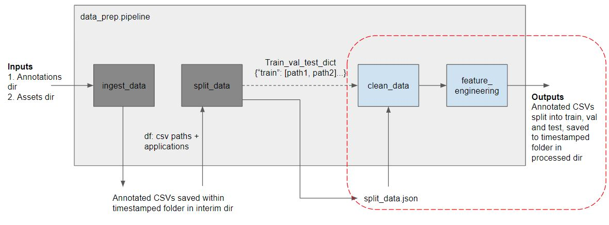

# Retraining Package
## ABB: Anomaly Detection/Forecast for Industrial Motor Sensors

This retraining package is meant for retraining a new model as more data and assets are available. After retraining, the timestamped model folder of choice can be transferred for use in the inference package.

---
## Table of Contents

- [Introduction](#introduction)
    - [Contents of Package](#contents-of-package)
- [System Requirements](#system-requirements)
    - [Recommended CLI Tool](#recommended-cli-tool)
    - [Hardware](#hardware)
    - [Software](#software)
- [Set Up](#set-Up)
    - [Setting up of Docker Desktop](#setting-up-of-docker-desktop)
    - [Loading of Docker Images](#loading-of-docker-images)
- [Usage](#usage)
    - [Mounted Volumes](#mounted-volumes)
    - [Running Retraining](#running-retraining)
- [Customization](#customization)
    - [Changing of Mounted Directories](#changing-of-mounted-directories)
    - [Doing multirun](#doing-multirun)
    - [Edit Config Files](#edit-config-files)
- [Uninstallation](#uninstallation)
    - [Removal of Docker Containers and Images](#removal-of-docker-containers-and-images)

---
## Introduction

### Contents of Package

1. README.md
2. conf/
3. data/
4. models/
5. scripts/
6. retraining.tar
7. assets/ (this contains images assets used for rendering README.md)

---
## System Requirements

As previously discussed, the specifications for the deployment PC should be as follows:

### Recommended CLI tools

These are the CLI tools that you can use:

1. Command Prompt ***recommended***
2. Powershell
3. Anaconda Prompt

### Hardware

|            |   Minimum  | Recommended |
| -----------| ----------- | -----------  |
| CPU | Intel Xeon E5 / Silver | |
| GPU | NVIDIA Quadro P2000 5GB | NVIDIA GPU with at least 8GB |
| RAM | 16 GB | |
| Storage | 256 | as required | 

### Software

|            |   Minimum  | Recommended |
| -----------| ----------- | -----------  |
| OS | Windows 10 1903 | Windows 10 21H2 or Windows 11 |
| Software | WSL2, Cuda drivers on WSL and Docker Desktop |

*Windows 10 21H2 or Windows 11 is recommended as it allows GPU passthrough for Docker - GPU Training on Models*

---
## Set Up

### Setting up of Docker Desktop

Please refer to this [guide](https://docs.docker.com/desktop/windows/install/) in the official docker documentation website.

After the successful installation of Docker Desktop, check if Virtualization is supported by the CPU. You may refer to this [guide](https://stackoverflow.com/questions/49005791/how-to-check-if-intel-virtualization-is-enabled-without-going-to-bios-in-windows#:~:text=If%20you%20have%20Windows%2010,is%20currently%20enabled%20in%20BIOS.).

### Loading of Docker Images

Follow the following steps to load the docker image into Docker Desktop.

1. Change working directory to folder where it contains the .tar image

2. Run the following code to load the .tar image. `docker load -i retraining.tar` .
The layers for the image will start to load and you should see a message similar to `Loaded image: <image name>:<image tag>` after loading all layers.

3. Run ``` docker images ``` to verify that there's a newly created image. You should see something similar to the following in your CLI. The image ID and tag might differ. The image tag (`5f05d10d` in the following example) will be used when running the container in [Running Retraining](#running-retraining) section.

```
REPOSITORY                           TAG          IMAGE ID       CREATED        SIZE
asia.gcr.io/abbpl-aut0/retraining    5f05d10d     03038024f643   2 hours ago    5.82GB
```

---
## Usage

### Mounted Volumes
There will be up to 4 mounted volumes for the retraining container:

1. `/conf` will contain the config file used to specify hyperparameters in data preparation and model architecture
2. `/data` will contain the data required for model training. Initially there should only be an `input` folder with `assets` and `annotations` subfolders. Subsequently, as it goes through pipeline, `interim` and `processed` folders will also be created based on data in `input` folder
3. `/models` is an empty folder meant to be storing models and other artifacts such as scalers and encoders from model training. These will be used for inference subsequently. Depending on values specified in `train_pipeline.yml`, more specifically the lookahead_period parameter, the models and artifacts will either be saved in `detection` (if lookahead_period == 0) or `forecast` (if lookahead_period > 0) subfolders.
4. `/scripts` will contain `retraining.sh`. This directory only needs to be mounted if multiruns are desired. The default `retraining.sh` built in docker image does only a single run with the specified hyperparameters.

#### Folder Structure of conf
```
conf
 └── train_pipeline.yml
```

#### Folder Structure of data
```
data
 ├── input
 │    └── assets
 │         └── Crusher3
 │              ├── Crusher3_startdate_enddate1.xlsx
 │              └── Crusher3_startdate_enddate2.xlsx
 |        annotations
 |         ├── annotations_1.xlsx
 |         └── annotations_2.xlsx
```
*Interim, Processed and Predictions folders will be created by pipeline if it doesnt exist*
#### Folder Structure of scripts
```
scripts
 └── retraining.sh
```

### Running Retraining

Run the following line in CLI to perform model retraining
``` 
docker run --rm --shm-size=2gb --gpus all ^
-v <local path to data folder>:/home/abb/data ^
-v <local path to conf folder>:/home/abb/conf ^
-v <local path to models folder>:/home/abb/models asia.gcr.io/abbpl-aut0/retraining:<image tag>
```
For example, if I had extracted the `retraining_container` folder in provided zip file to `C:\Users\jtzm\PythonProjects`, and had confirmed the image's tag as `5f05d10d` via `docker images`, then I would run the following  
``` 
docker run --rm --shm-size=2gb --gpus all ^
-v C:\Users\jtzm\PythonProjects\retraining_container\data:/home/abb/data ^
-v C:\Users\jtzm\PythonProjects\retraining_container\conf:/home/abb/conf ^
-v C:\Users\jtzm\PythonProjects\retraining_container\models:/home/abb/models asia.gcr.io/abbpl-aut0/retraining:5f05d10d
```
You should see logger messages running, indicating that the retraining has started and running.
The logger message "End to End Training completed in xxx.xx seconds ---" marks the end of model retraining.

For further elaboration of the flags used in the above command:
- `--rm` automatically cleans up the container and remove the file system when retraining has finished and container exits. If you wish to retain the container for any debugging purposes, then simply remove this flag.
- `--gpus all` assign all available gpus to the docker container. If you would like to work with only cpu, then simply remove this flag.
- `--shm-size=2gb` specifies the shared memory that a container can use. By default, shared memory size of docker container is 64mb. The size does not need to be fixed at 2gb and can be changed as desired. Using the default of 64mb causes issues with our default data loader parameters which is set to num_workers=3. If this flag is removed, num_worker parameter has to be changed to 1 in `train_pipeline.yml`. See [Edit Config Files](#edit-config-files) for more details.
- `-v <local dir>:<container dir>` mounts a local volume to one referenced by container. In the case of mounting our local model directory, this helps the saved model to persist in our specified model directory. In the case of data directory, this allows the container to access any new or other data on user's end that was not available at the time the container was created. 

One may notice that the scripts folder has not been mounted in the above commands. This folder only needs to be mounted if user wishes to conduct hyperparameter tuning and train multiple models with hyperparameters varying in a user-defined searchspace. The details of this will be covered under [Doing multirun](#doing-multirun) in the next <i>"Customization"</i> section.

---
## Customization

### Changing of Mounted Directories
It is possible to mount other directories apart from the ones provided in this retraining package. However the folder structure should remain identical to the ones provided in this training package.

For example, to use data from `C:\Users\abb1\new_data`, config file from `C:\Users\abb2\new_config` and to store models in `C:\Users\abb3\model` we will run the docker container with
``` 
docker run --rm --shm-size=2gb --gpus all ^
-v C:\Users\abb1\new_data:/home/abb/data ^
-v C:\Users\abb2\new_config:/home/abb/conf ^
-v C:\Users\abb3\model:/home/abb/models asia.gcr.io/abbpl-aut0/retraining:5f05d10d
```

### Doing Multirun
By default, the container would only train a single model with the hyperparameters specified in `conf/train_pipeline.yml`. If user wishes to do hyperparameter tuning by varying certain hyperparameters and training multiple models, they can make use of hydra's multi-run feature. More details on hydra's multi-run can be found [here](https://hydra.cc/docs/tutorials/basic/running_your_app/multi-run/). 

In order to override the default behaviour and do a multirun, user would have to mount the provided scripts folder as follows:
```
docker run --rm --shm-size=2gb --gpus all ^
-v <local path to data folder>:/home/abb/data ^
-v <local path to conf folder>:/home/abb/conf ^
-v <local path to scripts folder>:/home/abb/scripts ^
-v <local path to models folder>:/home/abb/models asia.gcr.io/abbpl-aut0/retraining:<image tag>
```

For reference, `retraining.sh` in scripts folder should be as follows.

```shell
source activate anomaly-predictor
python -m src.anomaly_predictor.run_training --multirun
```

If you run into any errors after mounting scripts folder, please ensure the file's end of line sequence is `LF` instead of `CRLF`. For more details on how to check or do the change, you could refer [here](https://stackoverflow.com/a/39532890) assuming you have Visual Studio Code installed.

### Edit Config Files
`train_pipeline.yml` in the conf folder can be used to change any hyperparameters used in data preparation and model training. We'll attempt to explain here what each of the parameters are used for. There are 4 main sections in `train_pipeline.yml`: defaults, hydra, data_prep and modeling. We'll go more into details for the data_prep and modeling sections since they are larger and also custom.

#### Defaults and Hydra
This section is only relevant when multirun is performed. It specifies to use optuna's TPESampler for hyperparameter search.

```yaml
defaults:
  - override hydra/sweeper: "optuna"
  - override hydra/sweeper/sampler: "tpe"

hydra:
  sweeper:
    sampler:
      seed: 123 # random seed for sampler
    direction: ["minimize", "maximize","maximize"] # Corresponds to metrics we are trying to optimize
    study_name: "lstm-big-sweep" # Optuna's study name
    storage: null
    n_trials: 2 # limits the number of trials run / models trained.
    n_jobs: 1

    search_space:
      data_prep.clean_data.outlier_threshold:
        type: "float"
        low: 2.5
        high: 3.5
        step: 0.5
      
      modeling.lstmae.model_params.hidden_size:
        type: "categorical"
        choices:
        - [[8, 4], [4, 8]]
        - [[128, 8], [8, 128]]
        - [[256, 16], [16, 256]]
```
For `hydra.sweeper.direction`, we are returning `fpr, f1, recall` from our main code and hence it has the value ["minimize", "maximize","maximize"] corresponding to the respective desired behaviour for the returned metrics.

`search_space` section is used to define the hyperparameters being varied. In this example above, the search space for outlier_threshold in data_prep's clean_data section is from 2.5 to 3.5 in the step of 0.5 i.e. possible values are 2.5, 3.0, 3.5. As for the hidden units in LSTM Autoencoder's individual layer, the possible values are listed under choices. It is possible to include any other hyperparameter found in the config file below (as long as it's sensible), such as window size, learning rate.

#### Data_prep


In data preparation, there are various preprocessing steps relating to data ingestion and annotation, data splitting, data cleaning and feature engineering.
```yaml
data_prep:
  pipeline:
    input_dir: "/home/abb/data/input"         # Do not change        
    interim_dir: "/home/abb/data/interim"     # Do not change         
    processed_dir: "/home/abb/data/processed" # Do not change 
    conf_dir: "/home/abb/conf"                # Do not change            

  ingest_data:
    assets_dir: "assets"    # name of subfolder in which assets data are stored                      
    annotation_list: [
        "annotations/annotations_20220224.xlsx",
        ...
        "annotations/annotations_20220317.xlsx",
    ] # list of annotations that should be used for ignoring or annotating which timepoints are anomalous
    time_col: "MEASUREMENT_TAKEN_ON(UTC)" # column name of timestamp, used for data indexing
    cut_off_date: "01-7-21" # Data before this date are ignored
    asset_timezone: 0
    annotation_timezone: 8
```
It is recommended not to change the paths listed under `data_prep.pipeline` until one has read through the code base.

As of writing, there was a firmware update for ABB sensors sometime around July, hence the `cut_off_date` parameter is introduced so that any data before this date are ignored. Note that this can be overridden on a per-asset basis via annotations. E.g. if Testpump1 was included in annotations and specified to ignore data before 8th August, then data before 8th August would be ignored. `asset_timezone` refers to the timezone of asset data, 0 implying that timestamps in assets folder are UTC +0. `annotation_timezone` refers to the timezone used in annotations, 8 implying that timestamps provided in annotations, either for ignoring or for designating anomalies, are in UTC+8.

```yaml
data_prep:
  ...
  split_data:
    by: "asset"     # expects values "asset" or "time"
    test_size: 0.2
    random_state: 42
    follow_split: ""
    # follow_split: "/home/abb/data/processed/20220601_005850/split_data.json" # change timestamped folder if using a different split
```
Parameters here pertain to train-val-test split. `by` expects values "asset" or "time". When data is split by asset, assets will be randomly shuffled (with user-defined random_state) and split such that each asset will be found in only 1 partition. Val and test shares the same proportion so with a `test_size` of 0.2, the assets will be in the following ratio 0.6 : 0.2 : 0.2 for train, val, test respectively. When data is split by time, all assets will be found across train, val, test partitions and data will be split chronologically, such that with a `test_size` of 0.2, the earliest 60% of the asset's data will be in train, the next 20% in val, and the most recent 20% will be in test set.

`follow_split` is typically left as an empty string "". However,if one wishes to use the same train-test split that an earlier model training session had used during data preparation, that can be done by specifying the filepath pointing to an existing split under `follow_split`. With this, the pipeline does not undergo data ingestion and annotation again, while also ensuring that model is trained on the same assets as before to facilitate model comparison. `follow_split` is best used when the filepaths listed in `follow_split` actually exist, such as using the "split_data.json" file from an earlier run where no split, or a valid split was provided. But if the filepaths do not exist, and data is split by asset (`split_data.by` = "asset"), then pipeline will attempt to perform annotation ingestion on input files again, and update the split to follow the specified asset distribution in the provided "split_data.json". If the filepaths in `follow_split` do not exist, and data is split by time (`split_data.by` = "time"), then pipeline will simply perform annotation ingestion and split the data chronologically, as if no `follow_split` was provided.

```yaml
data_prep:
  ...
  clean_data:
    features_to_standardize: [
        "Output Power",
        ...
        "Bearing Condition"
    ] # list of features that will be standardized and used for model training
    standardization_method: "RobustScaler" # also accepts value MinMaxScaler, StandardScaler
    outlier_threshold: 99999
    outlier_window: 5
    nan_range_threshold: 48
    impute_nan_window: 48
    impute_nan_period: 1
    impute_nan_center: True
    bearing_cond_fill: -1
    convert_to_int: ["Bearing Condition", "Anomaly"]
    scaler_args: # args for robust scaler 
      with_centering: True,      
      with_scaling: True,
      copy: True,
      quantile_range: [25.0, 75.0]
      unit_variance: False,
  feature_engineering:
    min_data_points: 24
    motor_supply_freq: "Motor Supply Frequency" 
    
  inference_encoder:
    enc_name: "encoder" # name under which one-hot encoder is stored
```
The parameters in `feature_engineering` used during feature_engineering to determine if asset is variable or fixed speed.


#### Modeling
```yaml
modeling:
  train_pipeline:
    setup_mlflow: False   # Do not set as True unless you have mlflow setup
    mlflow_autolog: False # Do not set as True unless you have mlflow setup
    mlflow_tracking_uri: "http://10.51.252.217:5005" 
    mlflow_exp_name: "lstm-big-sweep"
    mlflow_artifact_location: "gs://anomaly-predictor-artifacts/mlflow-tracking-server"
    processed_dir: "/polyaxon-v1-data/data/processed/20220520_095038" # No changes required, will be overwritten during pipeline
    model_name: "LSTMAE"            # Do not change unless you have added a new model type
    model_dir: "/home/abb/models"   # Do not change     
    conf_dir: "/home/abb/conf"      # Do not change

  mlflow_tags:
    hptuning_tag: "LSTM Detection model with big sweep params"
    estimator_name: "LSTMAE"
    estimator_class: "torch.LSTMAE"
```
Most arguments here do not need to be changed unless MLFlow is set up to track model experiments. 

```yaml
modeling:
  ...
  col_names:
    label_column: "Anomaly" # column name denoting Anomaly
    time_col: "MEASUREMENT_TAKEN_ON(UTC)" # column name of timestamp, used for data indexing

  use_individual_scaler: True

  data_loader:
    init:
      lookback_period: 336  # lookback window size
      lookahead_period: 0 # lookahead window size. Must be non-negative
      batch_size: 336   # torch.utils.data.dataloader parameter
      pin_memory: True  # torch.utils.data.dataloader parameter
      num_workers: 3    # torch.utils.data.dataloader parameter
      statistical_window: 0
    feature_to_standardize: [
      "Output Power",
      ...
      "Bearing Condition"
    ] # features that will be scaled
    shuffle: False      # torch.utils.data.dataloader parameter
    robust_scaler:      # robust scaler arguments for fitting individual and global scaler.
      with_centering: True,
      with_scaling: True,
      copy: True,
      quantile_range: [25.0, 75.0]
      unit_variance: False
```
During model training, data is scaled to help LSTMAE's weights and biases converge better. When `use_individual_scaler` is set as True, the assets are scaled individually. E.g. during model training, if Testpump001 is present, then a scaler will be fitted on its normal data and saved as `Testpump001.joblib`. Subsequently this scaler will be persisted in the mounted models folder. During inferencing, if Testpump001 asset is present, then scaler `Testpump001.joblib` will be used to transform Testpump001's data. Note that file naming is expected to be consistent here across model training and inferencing as that is used to determine if the same scaler is used for fitting and transforming. Using the same example of Testpump001, the pipeline expects the asset data during both training and inferencing to be `Testpump001_YYYYMMDD-YYYYMMDD`. If data is saved as `Pump - Testpump_001_YYYYMMDD-YYYYMMDD` during inferencing, then pipeline would not be able to recognize that they belong to the same asset.

There will still be a global scaler fitted on all available training data for unseen / unrecognized assets, though it is to be expected that model performance is not as good on unseen assets. 

```yaml
modeling:
  ...
  lstmae:
    model_params:
      hidden_size: [[64, 32], [32, 64]]
      n_layers: [2, 2]
      dropout: 0 # dropout probability at each layer
    lr: 0.001 # learning rate
    reconstruction_error_mode: "last_timepoint" # also accepts value "all"
    pred_threshold:
    max_reconstruction_error: 10
    early_stopping_params:
      patience: 70
      min_delta: 0
      path: "checkpoint.pt" # filename for checkpoints

  lstmae_training:
    n_epochs: 1 # maximum number of epochs used to train
```
This section is for model architecture and other related hyperparameters. `hidden_size` and `n_layers` describes the number of hidden units and layers in encoder and decoder layer. So with the above configuration, the LSTMAE would have 2 layer encoder of 64 and 32 units, and a layer decoder of 32 and 64 units. 

`reconstruction_error_mode` is an argument for how the reconstruction error is being calculated, either on all of the reconstructed window, or just the last timepoint.

`pred_threshold` is used for binarizing reconstruction error from LSTMAE. If left blank, pipeline tries to search for a threshold that maximizes recall while subject to a user-defined maximum false positive rate. More on this in the next `modeling.pred_threshold_search` section.

During model training, if model loss on the validation set doesn't decrease by `min_delta` after a set number of epochs, denoted by `patience`, then early stopping kicks in and model training is halted.

```yaml
modeling:
  ...
  pred_threshold_search:
    max_fpr: 0.2
    terminating_recall: 0.4
    default_pred_threshold: 0.5
```
If `modeling.lstmae.pred_threshold` was left as blank, then the pipeline tries to search for a 'best' threshold using data and labels from training set subject to constraints on FPR and then sets the model's pred_threshold as this value. 

With the above configuration, it will consider thresholds that allows the model to have up to 0.2 false positive rate on training data, and among these choose the threshold that results in the highest recall metric. To cut the search short, it will stop searching if recall reaches terminating_recall value, in this case 0.4. If no suitable threshold can be found, it then sets the model's pred_threshold with a default, in this case 0.5.

```yaml
modeling:
  ...
  evaluation:
    to_run: True
    columns: ["Asset_Name","Pointwise_Recall","Pointwise_F1_Score","Pointwise_FPR", "Overlap_Recall","Overlap_F1_Score","Overlap_FPR"]
    create_visualization: True
    create_encoder_output_tsne: False
    plotting_features: [
      "Vibration (Axial)",
      ...
      "Peak to Peak (Z)",
    ] # features plotted for visualization

  visualization_args: 
    Pointwise_F1_Score:
      top_n_assets: 2
      bottom_n_assets: 2
    Overlap_FPR:
      top_n_assets: 5
      bottom_n_assets: 5
```
By default, evaluation will take place after model training. If no annotations are provided, and hence no meaningful evaluation can take place, then `to_run` can be changed to False. Note that not including annotations on what points were anomalous may impact model performance as the pipeline is designed to only train model and fit scalers on non-anomalous data. Furthermore, one must ensure that `modeling.lstmae.pred_threshold` is not left as blank as that threshold is determined during evaluation time.

`columns` correspond to the column names in `evaluation.csv`. The column names also correspond to the metrics being plotted under `visualization_args`. It is recommended not to change this value until one has read the code base.

`create_visualization` is the switch for plotting the top_n assets and bottom_n assets in each train, val, test partition based on their individual metrics. Further customization on the metrics used to determine what is considered "top n" or "bottom n" is found under `visualization_args`. With the above configuration, up to 2 assets (in each train, val, test partition) which contained anomalous periods and scored highest on F1 will be plotted, along with another 2 assets that scored lowest on F1. Then, 5 assets which scored highest for Overlap_FPR will be plotted, along with another 5 which scored lowest. Note that for F1 and recall, only assets which contain anomalous periods are considered because if the asset only has fully normal data, their recall and F1 would naturally be 0. Also the number of assets plotted here is subjected to how many assets are available. If it was specified to plot the top 2 and bottom 2 assets for F1, but there's only 1 asset in test set that contains any anomalous periods, then there will only be 1 asset plotted.

`create_encoder_output_tsne` is the switch for outputting tsne plots (on a per-asset basis) of the output from the encoder layer of the LSTM Autoencoder model.

---
## Uninstallation

### Removal of Docker Containers and Images

Note that in order to remove image, there must be no containers (including stopped ones) that are utilizing said image. One could either force removal of image or remove the stopped container. Firstly check for the list of containers via `docker ps -a`. If there are no containers, you should see an empty list as follows with no further lines.
```
CONTAINER ID   IMAGE     COMMAND   CREATED   STATUS    PORTS     NAMES
```
If there are any containers running, stop running containers with `docker stop <container id>`.
Remove a stopped container with `docker rm <container id>` or remove all with `docker rm $(docker ps -a -q)`

Check for images available with `docker images`. You should see something similar to the following in your CLI:
```
REPOSITORY                           TAG          IMAGE ID       CREATED        SIZE
asia.gcr.io/abbpl-aut0/retraining    5f05d10d     03038024f643   2 hours ago    5.82GB
```

Remove an image with `docker rmi <image id>` or remove all images with `docker rmi $(docker images -q)`


