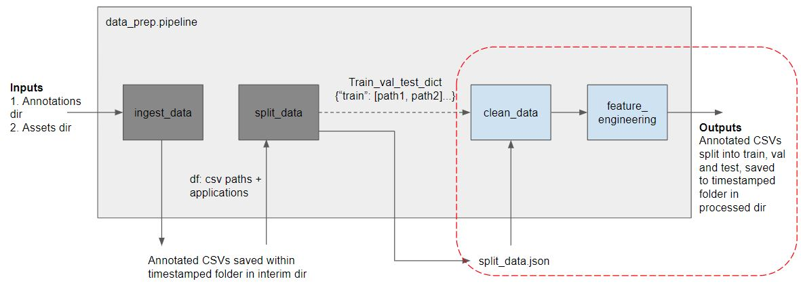

src.anomaly\_predictor.data\_prep
=================================

Overview
----------

**Retraining Data Preparation Pipeline**

When performing data preparation for retraining, input data from assets directory
are combined, along with ingested annotations from annotations directory via helper
function :func:`~src.anomaly_predictor.data_prep.pipeline_helpers.run_annotation_ingestion`
and then saved to the interim directory.

Assets are then split into train, validation and test partitions through helper function
:func:`~src.anomaly_predictor.data_prep.pipeline_helpers.run_data_splitter`, stratified against
the application type. The filepaths of files in train, validation and test partitions
are saved and persisted as file ``split_data.json``, so that the same split can be used
in future. 

Data Cleaning is then done on each partition by initializing :class:`~src.anomaly_predictor.data_prep.clean_data.DataCleaner`
and running its main method :meth:`~src.anomaly_predictor.data_prep.clean_data.DataCleaner.clean_data`.

Feature engineering is then performed via helper function :func:`~src.anomaly_predictor.data_prep.pipeline_helpers.feature_engineer_df_list`,
and finally these dataframes are saved as csv files in processed directory in their
respective train, validation and test partitions, to be used for model training and evaluation
through data loaders.

In the event that a ``split_data.json`` is already available from previous model
retraining and the user wishes to use the same split to facilitate model comparison, 
user could specify the absolute filepath of the ``split_data.json`` in retraining's configuration
file. When this is done, pipeline will skip annotation ingestion phase. For data splitting,
instead of using the previously mentioned ``run_data_splitter``, 
:func:`~src.anomaly_predictor.data_prep.pipeline_helpers.get_split_dict_from_json`
will be used to read ``split_data.json`` file and then proceed to perform data cleaning 
and feature engineering and saving of files in processed directory and their respective
partition as previously described. The distribution of assets in the processed directory
would match the assets and their respective partitions specified in ``split_data.json``.

**Inference Data Preparation Pipeline**

.. figure:: ../assets/images/data_prep_inference_pipeline.jpg
   :scale: 75 %
   :alt: Data prep pipeline during inference
   :align: center

Data preparation during inference is largely similar to retraining, the main differences
being that data splitting does not occur and that during feature engineering, the 
``OneHotEncoder`` used for encoding of application type is loaded from an existing 
fitted encoder. This encoder should be the same encoder saved from when the current 
model being used for inference purposes was trained.

**Helper functions**

Helper functions in ``pipeline_helpers`` are functions that are either utilized  
in both train pipeline and inference pipeline or are refactored out for
better readability.

The following helper functions are used in both training and inference pipeline for data preparation.

- :func:`~src.anomaly_predictor.data_prep.pipeline_helpers.setup_logging_and_dir` reads 
  the values from Hydra config file, helps with logging relevant directories and 
  ensures directories are timestamped, where necessary.
- :func:`~src.anomaly_predictor.data_prep.pipeline_helpers.run_annotation_ingestion` reads
  values from Hydra config file, uses it to initialize :class:`~src.anomaly_predictor.data_prep.ingest_data.AnnotationIngestor` 
  to ingest both annotations and input files to create interim files. During training,
  both ignored periods and anomalous periods in annotations are ingested. During inference,
  only ignored periods in annotations are ingested since anomalous periods are not expected
  to be known during inference.
- :func:`~src.anomaly_predictor.data_prep.pipeline_helpers.feature_engineer_df_list` does
  feature engineering using given features. The features engineered are the same during
  training and inference.
- :func:`~src.anomaly_predictor.data_prep.pipeline_helpers.get_clean_data_config`
  was introduced to change the read value for ``quantile_range`` in config file from 
  list to tuple since sk-learn's ``RobustScaler`` expects a tuple for key ``quantile_range``.

The following helper functions are only used in training. More details about the 
function can be found in their respective documentation.

- :func:`~src.anomaly_predictor.data_prep.pipeline_helpers.run_data_splitter`
- :func:`~src.anomaly_predictor.data_prep.pipeline_helpers.get_split_dict_from_json`
- :func:`~src.anomaly_predictor.data_prep.pipeline_helpers.update_split_dict`

Pipelines and helpers
---------------------

src.anomaly\_predictor.data_prep.train\_pipeline
------------------------------------------------------
.. automodule:: src.anomaly_predictor.data_prep.train_pipeline
   :members:
   :undoc-members:
   :show-inheritance:

src.anomaly\_predictor.data_prep.inference\_pipeline
------------------------------------------------------
.. automodule:: src.anomaly_predictor.data_prep.inference_pipeline
   :members:
   :undoc-members:
   :show-inheritance:

src.anomaly\_predictor.data_prep.pipeline_helpers
------------------------------------------------------
.. automodule:: src.anomaly_predictor.data_prep.pipeline_helpers
   :members:
   :undoc-members:
   :show-inheritance: